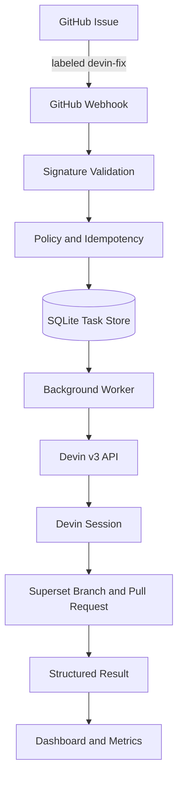

# Devin Autonomous Remediation Control Plane

> **The control plane governs the work. Devin performs the engineering.**

An event-driven Python service that listens for approved GitHub issues, dispatches them to the Devin autonomous engineering agent, and tracks the resulting pull request through a lightweight SQLite-backed dashboard and metrics endpoint.

## Table of Contents

1. [Problem](#problem)
2. [Solution](#solution)
3. [Why Devin](#why-devin)
4. [Architecture](#architecture)
5. [Event Sequence](#event-sequence)
6. [Prerequisites](#prerequisites)
7. [Devin Enterprise Setup](#devin-enterprise-setup)
8. [GitHub Webhook Setup](#github-webhook-setup)
9. [Environment Variables](#environment-variables)
10. [Docker Startup](#docker-startup)
11. [Dry-Run Simulation](#dry-run-simulation)
12. [Duplicate-Event Demonstration](#duplicate-event-demonstration)
13. [Real GitHub Workflow](#real-github-workflow)
14. [API Endpoints](#api-endpoints)
15. [Observability](#observability)
16. [Tests](#tests)
17. [Security Controls](#security-controls)
18. [Failure Handling](#failure-handling)
19. [Design Decisions](#design-decisions)
20. [Limitations](#limitations)
21. [Production Evolution](#production-evolution)
22. [Loom Demo](#loom-demo)
23. [Example Issue and PR](#example-issue-and-pr)

## Problem

Engineering teams accumulate GitHub issues that are small, well-scoped, and repetitive, yet they still require context switching, branch management, verification, and pull request hygiene. Automating the execution itself is risky because raw code generation can bypass policy, verification, and repository conventions. A safe autonomous workflow needs a control plane that decides what to do, and a trusted autonomous agent that does the engineering.


## Solution

The control plane exposes a single secure webhook endpoint. When a repository maintainer labels an issue with `devin-fix`, the plane verifies the request, persists the event, creates a durable task, and hands the task to Devin. It then polls the Devin session, normalizes status, classifies success from structured evidence, and surfaces the result in a dashboard and metrics endpoint.


## Why Devin

Devin is the core execution primitive because it is an autonomous software engineering agent that can read issues, inspect code, create branches, run verification commands, and open pull requests. The control plane does not generate code. It governs eligibility, idempotency, concurrency, secret handling, and verification tracking so Devin can focus on engineering.


## Architecture



Components:

- **GitHub webhook receiver** (`POST /webhooks/github`): raw-body HMAC-SHA256 validation via `X-Hub-Signature-256`.
- **Eligibility policy**: only `issues.labeled` with `devin-fix` on an open issue in `GITHUB_ALLOWED_REPOSITORY` is accepted.
- **SQLite task store**: SQLAlchemy 2 + `aiosqlite` persists webhook deliveries and remediation tasks.
- **Background worker**: FastAPI lifespan loop claims `QUEUED` tasks, creates one Devin session per claim, polls active sessions, and applies repository-level concurrency limits.
- **Devin client**: typed async HTTPX client with bounded retries, explicit timeouts, and sanitized errors.
- **Dashboard / metrics**: Jinja2 server-rendered HTML and JSON endpoint for leadership observability.

## Event Sequence

1. A maintainer applies the `devin-fix` label to an open issue.
2. GitHub sends an `issues.labeled` event with `X-GitHub-Delivery` and `X-Hub-Signature-256`.
3. The control plane verifies the HMAC signature and parses the raw body.
4. A `WebhookDelivery` row records the event; a duplicate `X-GitHub-Delivery` increments `attempt_count` and returns `200`.
5. An eligible event creates a `RemediationTask` with status `QUEUED`.
6. The worker claims the task, moves it to `DISPATCHING`, and calls Devin `POST /v3/organizations/{org_id}/sessions`.
7. The task becomes `RUNNING`; the worker polls until complete evidence or a terminal session state.
8. The worker combines structured output, PR existence, required verification results, and
   supplemental warnings to set the remediation outcome. Devin session lifecycle status and
   `status_detail` are persisted separately.
9. The dashboard and `/metrics` reflect the outcome.

## Prerequisites

- Python 3.12+
- `git`
- Docker and Docker Compose (optional, for containerized run)
- A Devin Enterprise API key and organization ID
- A GitHub repository and webhook secret

## Devin Enterprise Setup

1. Create or obtain a Devin API key from your Devin Enterprise dashboard.
2. Note your Devin organization ID.
3. Set `DEVIN_API_KEY` and `DEVIN_ORG_ID` in your `.env` file.
4. Ensure your Devin account has access to the target engineering repository (`qingliaowu/superset` by default).

## GitHub Webhook Setup

1. In the target GitHub repository, go to **Settings > Webhooks > Add webhook**.
2. Set **Payload URL** to `https://<your-host>/webhooks/github`.
3. Set **Content type** to `application/json`.
4. Generate a long random secret and set it as `GITHUB_WEBHOOK_SECRET` in `.env` and in the webhook configuration.
5. Subscribe to **Issues** events.
6. Add the `devin-fix` label to the repository labels.

## Environment Variables

Copy `.env.example` to `.env` and fill in the real values.

| Variable | Purpose |
| --- | --- |
| `GITHUB_WEBHOOK_SECRET` | HMAC-SHA256 secret shared with GitHub |
| `GITHUB_ALLOWED_REPOSITORY` | Only issues from this repo are processed |
| `GITHUB_TARGET_BRANCH` | Target branch for generated pull requests |
| `DEVIN_API_BASE_URL` | Devin API base URL |
| `DEVIN_API_KEY` | Devin API key |
| `DEVIN_ORG_ID` | Devin organization ID |
| `DEVIN_REPO` | Engineering repository Devin should work in |
| `DEVIN_MODE` | Devin session mode (default `normal`) |
| `DEVIN_MAX_ACU_LIMIT` | Maximum ACU limit per session |
| `DEVIN_DRY_RUN` | When `true`, use mock Devin sessions |
| `POLL_INTERVAL_SECONDS` | Worker poll interval |
| `MAX_CONCURRENT_TASKS_PER_REPOSITORY` | Repository-level concurrency limit |
| `DATABASE_URL` | SQLite database URL |
| `HOST` / `PORT` | Application bind host and port |
| `LOG_LEVEL` | Python log level |

## Docker Startup

```bash
cp .env.example .env
# edit .env with your credentials
docker compose up --build -d
```

The app listens on port `8000`. The named volume `sqlite_data` mounts `/data` inside the container so SQLite data survives ordinary restarts. The container runs as a non-root user and no secrets are copied into the image; they are loaded at runtime from `.env`.

## Dry-Run Simulation

Dry-run mode exercises the full workflow without calling the real Devin API.

```bash
# .env
GITHUB_WEBHOOK_SECRET=test-secret
GITHUB_ALLOWED_REPOSITORY=qingliaowu/superset
DEVIN_DRY_RUN=true
DATABASE_URL=sqlite+aiosqlite:///./auto_remediation.db
```

Start the server:

```bash
.venv/bin/uvicorn auto_remediation.main:app --reload
```

Send a signed webhook:

```bash
.venv/bin/python scripts/simulate_webhook.py \
    --issue-number 42 \
    --issue-title "Fix login redirect" \
    --repository qingliaowu/superset \
    --secret test-secret
```

The dashboard at `http://127.0.0.1:8000/dashboard` will show a `DRY RUN` badge and a mock Devin session.

## Duplicate-Event Demonstration

GitHub may resend a webhook. The control plane uses `X-GitHub-Delivery` for idempotency.

```bash
.venv/bin/python scripts/simulate_webhook.py \
    --issue-number 42 \
    --issue-title "Fix login redirect" \
    --duplicate
```

The first request creates a task. The second request returns `200 duplicate` and increments `attempt_count` without creating a second task.

## Real GitHub Workflow

1. Deploy the control plane with `DEVIN_DRY_RUN=false` and valid Devin credentials.
2. Configure the GitHub webhook as described above.
3. Open an issue in `GITHUB_ALLOWED_REPOSITORY`.
4. Apply the `devin-fix` label.
5. The worker creates a Devin session; Devin inspects the issue, makes a branch, commits, pushes, and opens a PR.
6. The worker polls until the session is terminal and classifies the result.
7. Review the PR at the link shown on `GET /dashboard` or `GET /tasks/{task_id}`.

## API Endpoints

| Endpoint | Method | Description |
| --- | --- | --- |
| `/health` | GET | Liveness probe |
| `/metrics` | GET | JSON observability metrics |
| `/dashboard` | GET | Server-rendered dashboard |
| `/dashboard/tasks/{task_id}` | GET | Server-rendered task detail |
| `/webhooks/github` | POST | GitHub webhook receiver |
| `/tasks` | GET | List all remediation tasks |
| `/tasks/{task_id}` | GET | Get a single task as JSON |

## Observability

`GET /metrics` returns:

- `webhook_delivery_attempts`
- `unique_webhook_deliveries`
- `eligible_tasks`
- `ignored_events`
- `duplicate_attempts`
- `devin_sessions_created`
- `active_tasks`
- `waiting_tasks`
- `successful_tasks`
- `failed_tasks`
- `tasks_with_warnings`
- `pull_requests_created`
- `success_rate`
- `success_rate_percent`
- `average_successful_task_duration_seconds`
- `total_acus_consumed`

The dashboard renders these as cards and lists recent tasks with status, dry-run indicator, Devin
session link, PR link, verification summary, and supplemental warnings.

## Tests

```bash
.venv/bin/ruff check src tests
.venv/bin/ruff format --check src tests
.venv/bin/pytest -q
```

## Security Controls

- Raw request bodies are verified with `hmac.compare_digest` before parsing.
- Webhook secrets and API keys are read from environment variables and are never logged.
- The simulator signs the exact body bytes using `GITHUB_WEBHOOK_SECRET`.
- The Docker image runs as a non-root user and does not copy `.env` into the image.
- Devin API keys are sent only in the `Authorization` header and are redacted from exception messages.

## Failure Handling

- **Invalid signature**: `401 Unauthorized`.
- **Malformed JSON**: `400 Bad Request`.
- **Ineligible event**: `200 OK` with ignored reason.
- **Duplicate delivery**: `200 OK` and `attempt_count` incremented.
- **Devin client errors**: sanitized `error_code` and `error_message` persisted; task becomes `FAILED`.
- **Ambiguous POST timeouts**: not retried to avoid duplicate Devin sessions.
- **Restart recovery**: `QUEUED` and `RUNNING` tasks are reloaded; `DISPATCHING` tasks without a session ID are returned to `QUEUED`.
  Tasks with stored structured output are re-classified without opening a new Devin session.

## Design Decisions

- **SQLite over Redis/Celery/Kubernetes**: keeps the take-home self-contained and requires no external infrastructure.
- **FastAPI lifespan worker**: avoids a separate worker process while remaining restart-safe.
- **Server-rendered Jinja2 dashboard**: no React build step; minimal and professional.
- **Per-repository concurrency**: `MAX_CONCURRENT_TASKS_PER_REPOSITORY` protects Devin resources and the target repo from too many simultaneous sessions.
- **Success from evidence, not status**: `SUCCEEDED` requires structured `outcome == success`, a
  real PR URL, and every required verification item passing. Supplemental failures produce
  `PASSED_WITH_WARNINGS` without failing the remediation. Completion evidence can finalize a
  task before Devin reports a terminal top-level status; `status_detail` values for waiting
  states take precedence over `status`.

## Limitations

- Single-node deployment; horizontal scaling would require a shared message queue and database.
- SQLite is sufficient for local and low-volume usage; production at scale should use PostgreSQL.
- GitHub App authentication is not implemented; all repositories share one webhook secret.
- No automatic PR merge; the system only opens and verifies pull requests.

## Production Evolution

- Replace SQLite with PostgreSQL and move the worker to a separate process or container.
- Add a task queue such as Celery with Redis or a managed job queue.
- Add metrics exporters for Prometheus or Datadog.
- Introduce repository-level allowlists and branch protection checks.
- Add webhook replay and delivery log retention.
- Support GitHub App JWT authentication and per-installation secrets.

## Loom Demo

[https://www.loom.com/share/35320638413f499d9e4f91dc01f059e4]

## Example Issue and PR

- Example issue: `https://github.com/qingliaowu/superset/issues/<number>`
- Example pull request: `https://github.com/qingliaowu/superset/pull/<number>`
