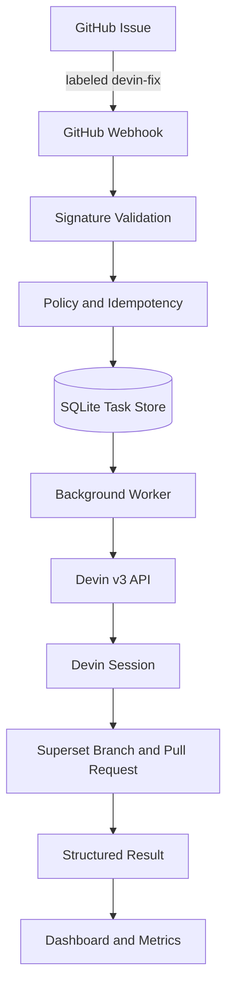

# Architecture

> The control plane governs the work. Devin performs the engineering.

The Devin Autonomous Remediation Control Plane is a single Python service that sits between GitHub and the Devin API. It enforces policy, guarantees idempotency, tracks durable tasks, and provides observability.

## Component Overview

## Layers

### Webhook Receiver

`POST /webhooks/github` reads the raw request body before JSON parsing. It validates `X-Hub-Signature-256` with HMAC-SHA256 and `hmac.compare_digest`, then inspects `X-GitHub-Event` and `X-GitHub-Delivery`.

### Policy and Idempotency

A delivery is eligible only when:

- `X-GitHub-Event == issues`
- `action == labeled`
- `label.name == devin-fix`
- `issue.state == open`
- `repository.full_name == GITHUB_ALLOWED_REPOSITORY`

A unique `github_delivery_id` constraint prevents duplicate tasks. Subsequent deliveries with the same ID increment `WebhookDelivery.attempt_count` and return a duplicate response.

### Task Store

SQLAlchemy 2 with `aiosqlite` persists two entities:

- `WebhookDelivery` — every received payload and outcome.
- `RemediationTask` — the durable unit of work, including session state, structured output, verification, and error information.

### Background Worker

A FastAPI lifespan task:

1. Recovers non-terminal tasks on startup.
2. Claims one `QUEUED` task per repository up to `MAX_CONCURRENT_TASKS_PER_REPOSITORY`.
3. Creates exactly one Devin session per claim and stores the exact `session_id`.
4. Polls non-terminal sessions at `POLL_INTERVAL_SECONDS`.
5. Classifies final success from structured output, PR URL, and verification results.

### Devin Client

Typed async HTTPX client:

- Explicit connect/read/write timeouts.
- Bounded GET retries and 429 retries.
- No blind retry of ambiguous POST timeouts to avoid duplicate sessions.
- `Authorization: Bearer <DEVIN_API_KEY>` is never logged or surfaced in errors.

### Dashboard and Metrics

- `GET /metrics` returns JSON counters, rates, and ACU totals.
- `GET /dashboard` renders server-side Jinja2 HTML with task cards and a recent-task table.
- `GET /dashboard/tasks/{task_id}` shows a detailed task view with issue metadata, state timeline, verification results, and structured output.

## Data Flow

1. GitHub sends an `issues.labeled` event.
2. The receiver validates the signature and eligibility.
3. A `WebhookDelivery` row is inserted or updated.
4. An eligible event creates a `RemediationTask` with status `QUEUED`.
5. The worker claims the task and calls Devin.
6. Devin performs the engineering and returns structured output.
7. The worker finalizes the task and updates the dashboard and metrics.
